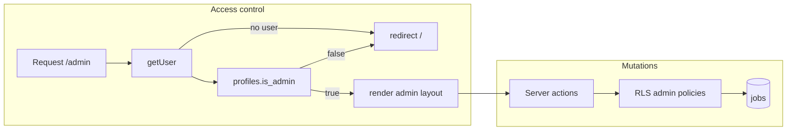

# Admin job management (`/admin/jobs`)

## Schema and RLS (new migration)

Add **one new migration** under `[supabase/migrations/](supabase/migrations/)` (do not edit older migration files). It should:

1. `**profiles.is_admin`** — `boolean not null default false`.
2. **Document one-time promotion** (comment block in the same file is fine), e.g.:

```sql
-- Run once in SQL Editor (replace email):
update public.profiles
set is_admin = true
where lower(btrim(email)) = lower('you@example.com');
```

1. `**jobs.status**` — extend `[jobs_status_check](supabase/migrations/20260410120000_jobs_status_and_detail_fields.sql)` to allow `**'deleted'**` (drop + re-add check constraint).
2. `**jobs.job_type**` — extend the column check from `[20260326183000_initial_schema.sql](supabase/migrations/20260326183000_initial_schema.sql)` to allow `**'hybrid'**` (drop `jobs_job_type_check` if present, re-add with the expanded list).
3. **RLS on `jobs`** (keep service-role scraper behavior: service role bypasses RLS in Supabase):
  - **Replace** `[jobs_select_all](supabase/migrations/20260326183000_initial_schema.sql)` with a policy that still allows **anon + authenticated** to read rows, but **hides `status = 'deleted'`** unless the reader is an admin:

```sql
-- Concept: non-deleted visible to everyone; deleted visible only to admins
using (
  status is distinct from 'deleted'
  or exists (
    select 1 from public.profiles p
    where p.id = auth.uid() and p.is_admin = true
  )
);
```

- **Add** `INSERT` for `authenticated` with `with check (exists (select 1 from profiles where id = auth.uid() and is_admin))`.
- **Add** `UPDATE` for `authenticated` with same `using` + `with check` (covers soft-delete, toggle, edits).
- **Do not** add a `DELETE` policy for authenticated users (soft-delete only via `UPDATE`; hard delete remains impossible via anon key).

1. `**apply_url` uniqueness vs soft delete** — Today’s partial unique index `[jobs_apply_url_unique_idx](supabase/migrations/20260411120000_jobs_last_seen_apply_url_unique.sql)` applies to **all** non-null URLs, so a **deleted** row still blocks re-inserting the same `apply_url`. In the same migration, **replace** that index with a partial unique index that excludes deleted rows, e.g. `where apply_url is not null and status is distinct from 'deleted'`, so admins can re-add a listing after soft delete. (Scraper upserts remain valid for live URLs.)
2. End with `notify pgrst, 'reload schema';` like other migrations.

**Public routes** `[app/jobs/page.tsx](app/jobs/page.tsx)`, `[app/jobs/[id]/page.tsx](app/jobs/[id]/page.tsx)`, and `[app/company/[slug]/page.tsx](app/company/[slug]/page.tsx)` already filter with `.eq("status", "open")` — **no changes required** for SEO pages once `deleted` exists. `[app/sitemap.ts](app/sitemap.ts)` already selects `open` only.

**Dashboard job board** `[components/jobs/JobBoard.tsx](components/jobs/JobBoard.tsx)` currently loads all jobs; add a query filter so `**deleted` never appears** for normal users (e.g. `.neq("status", "deleted")` or `.in("status", ["open","closed","draft"])`). This avoids showing removed roles in the user dashboard without touching public URLs.

---

## Server-side admin gate

- Add `[lib/require-admin.ts](lib/require-admin.ts)` exporting `**requireAdmin()`**:
  - `createClient()` from `[lib/supabase/server.ts](lib/supabase/server.ts)`.
  - `getUser()`; if no user → `redirect("/")`.
  - `from("profiles").select("is_admin").eq("id", user.id).maybeSingle()`; if not `is_admin` → `redirect("/")`.
  - Return `{ supabase, user }` for callers.
- Use `**requireAdmin()`** in `[app/admin/layout.tsx](app/admin/layout.tsx)` so every `/admin/*` page is protected. **Do not** add admin links to `[app/dashboard/layout.tsx](app/dashboard/layout.tsx)`, `[DashboardNav](app/dashboard/DashboardNav.tsx)`, or marketing nav.

Optional hardening: mirror the admin check inside each server action so tampered requests fail even if layout were bypassed (RLS is still the source of truth).

---

## Admin shell (Step 7)

- `[app/admin/layout.tsx](app/admin/layout.tsx)`: after `requireAdmin()`, render a **desktop-only** dark sidebar (simple `nav` + `Link`s): **Jobs** → `/admin/jobs`, **Reviews** → `/admin/reviews`, **Companies** → `/admin/companies`. Distinct from the light `[app/dashboard/layout.tsx](app/dashboard/layout.tsx)`.
- `[app/admin/page.tsx](app/admin/page.tsx)`: `redirect("/admin/jobs")`.
- Placeholder pages: `[app/admin/reviews/page.tsx](app/admin/reviews/page.tsx)`, `[app/admin/companies/page.tsx](app/admin/companies/page.tsx)` — minimal “Admin — coming soon” copy.

---

## `/admin/jobs` list (Step 2)

- `[app/admin/jobs/page.tsx](app/admin/jobs/page.tsx)`: Server Component; `requireAdmin()` then query `jobs` with `companies(name)` join (or use `company_name` already on `jobs` for display). **Sort** `created_at desc`.
- **Filters**: `searchParams` for `status` and `source` (e.g. `?status=open&source=manual`); apply `.eq` when set.
- **Pagination**: `page` param, **25** per page; Supabase `.range(offset, offset + 24)` + separate `count` query (or estimate) for “Next/Previous”.
- **UI**: Add shadcn `**Table`** and `**Badge`** primitives under `[components/ui/](components/ui/)` (not present today; small standard shadcn files). Columns: title, company name, location, source, **status badge** (green `open`, grey `closed`, yellow `draft`, muted `deleted`), `posted_at`, `last_seen_at`.
- **Actions** (client island or small client rows):
  - **Edit** → link to `/admin/jobs/[id]/edit`.
  - **Toggle** open ↔ closed only (skip when `draft` or `deleted` — define explicit behavior: e.g. disable toggle for draft/deleted, or only for open/closed).
  - **Delete** → opens confirm UI, then server action sets `status = 'deleted'`.
- **“+ Add New Job”** → `/admin/jobs/new`.

---

## Forms (Steps 3–4)

- `[app/admin/jobs/new/page.tsx](app/admin/jobs/new/page.tsx)` and `[app/admin/jobs/[id]/edit/page.tsx](app/admin/jobs/[id]/edit/page.tsx)`: shared **client** form component (e.g. `components/admin/AdminJobForm.tsx`) using existing **Input, Textarea, Select, Button, Label** and **Dialog** only if you choose modal flow; spec prefers dedicated routes — use **full page** forms.
- **Fields** (map to DB):
  - Title → `title` (required)
  - Company → required `company_id` + denormalized `company_name` (from selected company row)
  - Location → `location` (required)
  - Job type → `job_type`: `full-time` | `part-time` | `contract` | `remote` | `**hybrid`** (values stored as DB check allows)
  - Industry/Category → optional: simplest approach without a new column — **update `companies.industry`** when the field is non-empty and a `company_id` is set (second `update` in the same server action after validation)
  - Salary range → `salary_range` (optional)
  - Description → `description` (required)
  - Responsibilities / Requirements → existing columns (optional)
  - Apply URL → `apply_url` (required)
  - Status → `open` | `closed` | `draft` (default `open` on create)
- **Create**: `source = 'manual'`, `last_seen_at = now()`, set `posted_at` to `**now()`** (or `posted_at` if you want backdating — default `now()` keeps sorting sensible).
- **Company autocomplete (allowlisted UI)**: No Combobox in repo. Practical approach within **Input + Button + (optional) Dialog**: load a **bounded** list of companies server-side (e.g. `select id,name,slug,industry order by name` with a high limit or later add server search action). Client: filter list in memory as user types; clicking a row sets `company_id` / `company_name` / industry preview. If the list grows large, add a `**searchCompanies(query)` server action** and debounced fetch using the same primitives.
- Submit via **server actions** in e.g. `[app/admin/jobs/actions.ts](app/admin/jobs/actions.ts)` (`"use server"`), each calling `requireAdmin()` (or shared `assertAdmin()`), then `insert` / `update`. Use `[revalidatePath](https://nextjs.org/docs/app/api-reference/functions/revalidatePath)` for `/admin/jobs` and the edit route.
- **Toasts**: use `**toast` from `sonner`** (already in `[components/ui/sonner.tsx](components/ui/sonner.tsx)` + root `[app/layout.tsx](app/layout.tsx)`) — this is the project’s shadcn toast pattern; redirect after success and still fire toast on the landing list (e.g. `?created=1` + `useEffect` toast, or `redirect` with cookie — pick one small pattern).

---

## Toggle and delete (Steps 5–6)

- **Toggle**: server action `toggleJobStatusOpenClosed(id)` — if `open` then `closed`, else if `closed` then `open`; no-op for `draft`/`deleted`. Client calls action, `**toast.success`**, then `**router.refresh()`** (no full document reload).
- **Delete**: `[components/ui/alert-dialog.tsx](components/ui/alert-dialog.tsx)` for confirmation (“Are you sure? This cannot be undone.”) — maps to **soft** delete (`status = 'deleted'`), not `DELETE`.

---

## Types and docs

- Centralize string unions for admin UI: `JobStatus`, `JobType` including `hybrid` and `deleted` where relevant.
- After shipping, update `[AGENTS.md](AGENTS.md)` / `[CLAUDE.md](CLAUDE.md)` with `/admin/*`, `is_admin`, and RLS summary (per project convention).

---

## How the owner accesses admin (for README or handoff)

1. Deploy migration to Supabase (CLI or SQL Editor in order).
2. In **Supabase SQL Editor**, run the one-time `update profiles set is_admin = true where ... email ...` for the owner account (user must have signed in at least once so `profiles.id` matches `auth.users.id`).
3. Sign in on the site as that user.
4. Open `**https://thejobhunch.com/admin/jobs`** (or `http://localhost:3000/admin/jobs` locally). Non-admins and logged-out users hitting `/admin/*` should be **redirected to `/`** with no error banner.




